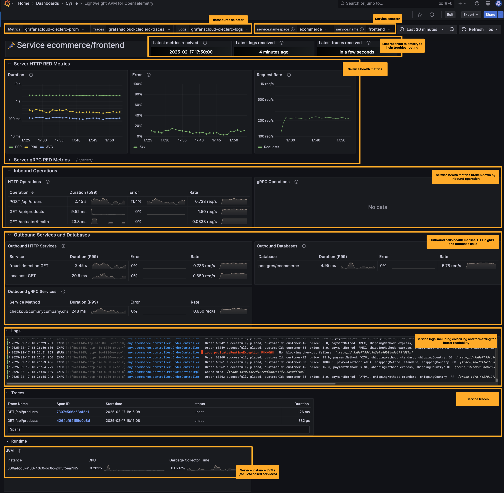

# Lightweight APM for OpenTelemetry

Instrument your applications using OpenTelemetry SDKs and send traces, metrics, and logs to [Tempo](https://grafana.com/oss/tempo/) for traces, a Prometheus-compatible database like [Mimir](https://grafana.com/oss/mimir/) for metrics, and [Loki](https://grafana.com/oss/loki/) for logs. This dashboard provides a centralized view of your application's health and performance.  

For a fully managed observability stack, consider using [Grafana Cloud](https://grafana.com/products/cloud/).


## Setup

* *IMPORTANT* Configure a [Prometheus](https://prometheus.io/) database like [Grafana Mimir](https://grafana.com/oss/mimir/) enabling resource attribute promotion
* Instrument services with OpenTelemetry SDK libraries and auto-instrumentation agents. Ensure the instrumentation produces:
  * Metrics: [HTTP metrics](https://opentelemetry.io/docs/specs/semconv/http/http-metrics/), [gRPC metrics](https://opentelemetry.io/docs/specs/semconv/rpc/rpc-metrics/), or [Database Client Metrics](https://opentelemetry.io/docs/specs/semconv/database/database-metrics/)
  * Traces: optional
  * Logs: optional
* Send generated telemetry (details in FAQ below):
  * Traces to [Grafana Tempo](https://grafana.com/oss/tempo/)
  * Metrics to a [Prometheus](https://prometheus.io/) database like [Grafana Mimir](https://grafana.com/oss/mimir/) using its OTLP endpoint
  * Logs to [Grafana Loki](https://grafana.com/oss/loki/) using the Loki OTLP/HTTP endpoint
* Ensure that a datasource is setup in Grafana for each of these Tempo, Prometheus, and Loki databases
* In Grafana, create the "OpenTelemetry Service" dashboard:
  * Navigate to "Dashboards" then click on the "New / New dashboard" button
  * Click on "Import a dashboard"
  * On the "Import dashboard" screen, enter the ID `22784` then click on the "Load" button

## Database configuration

### Prometheus OTLP Endpoint configuration

Example Prometheus OTLP Endpoint configuration

```yml
otlp:
  keep_identifying_resource_attributes: true
  promote_resource_attributes:
    # REQUIRED FOR THIS DASHBOARD
    - service.instance.id
    - service.name
    - service.namespace
    - deployment.environment.name
    # RECOMMENDED FOR OTEL METRICS IN GENERAL
    - service.version
    - cloud.availability_zone
    - cloud.region
    - container.name
    - deployment.environment
    - k8s.cluster.name
    - k8s.container.name
    - k8s.cronjob.name
    - k8s.daemonset.name
    - k8s.deployment.name
    - k8s.job.name
    - k8s.namespace.name
    - k8s.pod.name
    - k8s.replicaset.name
    - k8s.statefulset.name
```

Learn more in Prometheus [configuration reference](https://prometheus.io/docs/prometheus/latest/configuration/configuration/) and [OpenTelemetry guide](https://prometheus.io/docs/guides/opentelemetry/).

### Mimir OTLP Endpoint configuration

Configure the parameters `otel_keep_identifying_resource_attributes` and `promote_otel_resource_attributes` on the OTLP endpoint.

Example Mimir OTLP Endpoint configuration snippet:

```yml
# (experimental) Whether to keep identifying OTel resource attributes in the
# target_info metric on top of converting to job and instance labels.
# CLI flag: -distributor.otel-keep-identifying-resource-attributes
otel_keep_identifying_resource_attributes: true
# (experimental) Optionally specify OTel resource attributes to promote to
# labels.
# CLI flag: -distributor.otel-promote-resource-attributes
promote_otel_resource_attributes: "service.instance.id, service.name, service.namespace, service.version, cloud.availability_zone, cloud.region, container.name, deployment.environment, deployment.environment.name, k8s.cluster.name, k8s.container.name, k8s.cronjob.name, k8s.daemonset.name, k8s.deployment.name, k8s.job.name, k8s.namespace.name, k8s.pod.name, k8s.replicaset.name, k8s.statefulset.name"
```

Learn more in [Mimir configuration parameters](https://github.com/grafana/mimir/blob/main/docs/sources/mimir/configure/configuration-parameters/index.md).

### Grafana Cloud Metrics configuration

Send OpenTelemetry metrics to the Grafana Cloud OTLP Endpoint as documented in Grafana Cloud / Send OTLP data and open a support ticket to activate `otel_keep_identifying_resource_attributes`.

Note that the Grafana Cloud OTLP Endpoint is configured by default to promote the following resource attributes, this list can be modified through a support ticket. If your Grafana Cloud stack has not been configured, please open a support ticket. Default promoted resource attributes:

```yml
- service.instance.id
- service.name
- service.namespace
- deployment.environment.name
- service.version
- cloud.availability_zone
- cloud.region
- container.name
- deployment.environment
- k8s.cluster.name
- k8s.container.name
- k8s.cronjob.name
- k8s.daemonset.name
- k8s.deployment.name
- k8s.job.name
- k8s.namespace.name
- k8s.pod.name
- k8s.replicaset.name
- k8s.statefulset.name
```

## User guide



## FAQ

## What are the compatible OpenTelemetry SDKs and auto-instrumentations

Dashboard mostly tested with the [OpenTelemetry Instrumentation for Java](https://github.com/open-telemetry/opentelemetry-java-instrumentation),
compatible with instrumentation that produce OpenTelemetry compliant traces, logs, [HTTP metrics](https://opentelemetry.io/docs/specs/semconv/http/http-metrics/), [gRPC metrics](https://opentelemetry.io/docs/specs/semconv/rpc/rpc-metrics/), or [Database Client Metrics](https://opentelemetry.io/docs/specs/semconv/database/database-metrics/).

## How to send OpenTelemetry traces, metrics, and logs to Grafana Tempo, Mimir, and Loki

### Grafana Cloud

When using Grafana Cloud, follow the instructions of he Grafana Cloud documentation page
 [OpenTelemetry > Send data to the Grafana Cloud OTLP endpoint](https://grafana.com/docs/grafana-cloud/send-data/otlp/send-data-otlp/).

### Self managed Tempo, Mimir, and Loki

Example OpenTelemetry Collector configuration to send to self managed instances of Tempo, Mimir, and Loki:

Replace `tempo.example.com` , `mimir.example.com` , and `loki.example.com` by the desired host names.

For production deployments, enable TLS security and remove `insecure: true`.

```yaml
receivers:
  otlp:
    protocols:
      grpc:
        endpoint: 0.0.0.0:4317
      http:
        endpoint: 0.0.0.0:4318

processors:
  batch:

exporters:
  otlphttp/metrics:
    endpoint: http://mimir.example.com:9090/api/v1/otlp
    tls:
      insecure: true
  otlphttp/traces:
    endpoint: http://tempo.example.com:4418
    tls:
      insecure: true
  otlphttp/logs:
    endpoint: http://loki.example.com:3100/otlp
    tls:
      insecure: true
  debug/metrics:
    verbosity: detailed
  debug/traces:
    verbosity: detailed
  debug/logs:
    verbosity: detailed

service:
  pipelines:
    traces:
      receivers: [otlp]
      processors: [batch]
      exporters: [otlphttp/traces]
      #exporters: [otlphttp/traces,debug/traces]
    metrics:
      receivers: [otlp]
      processors: [batch]
      exporters: [otlphttp/metrics]
      #exporters: [otlphttp/metrics,debug/metrics]
    logs:
      receivers: [otlp]
      processors: [batch]
      exporters: [otlphttp/logs]
      #exporters: [otlphttp/logs,debug/logs]
```

## The drop down list for services is empty

TODO

## Support

Please report issues on https://github.com/cyrille-leclerc/opentelemetry-service-dashboard.

## License

 Apache-2.0 license.
